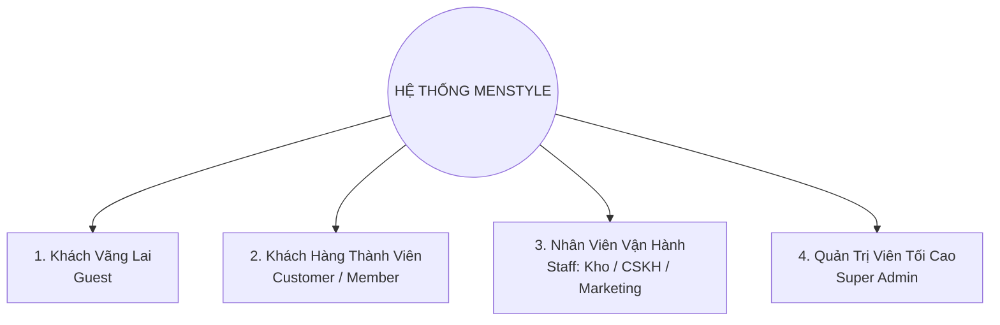

# BÁO CÁO KHẢO SÁT HỆ THỐNG THỜI TRANG NAM (BENCHMARKING & REQUIREMENT ANALYSIS)
**Dự án:** MENSTYLE - Hệ thống Thương mại điện tử Thời trang Nam Cao cấp  
**Họ tên người thực hiện:** lqnga112 (Database Designer)  
**Đối tượng khảo sát chuẩn mực:** Thương hiệu thời trang nam **Torano (torano.vn)**  

---

## I. TỔNG QUAN KHẢO SÁT WEBSITE THAM CHIẾU (TORANO.VN)
- **Đường dẫn khảo sát:** [https://torano.vn](https://torano.vn)
- **Đặc trưng ngành hàng:** Thời trang nam công sở và dạo phố (Áo sơ mi, Polo, Blazer/Suit, Quần âu, Quần jean, Phụ kiện dây lưng, ví da).
- **Mô hình kinh doanh:** B2C E-commerce kết hợp O2O (Online to Offline - chuỗi cửa hàng).

### 1.1. Các điểm mạnh thu thập được từ Torano.vn để áp dụng vào Database MENSTYLE:
1. **Phân loại sản phẩm đa cấp (Multi-level Category & Taxonomy):**
   - Phân cấp cha - con (VD: *Áo nam -> Áo sơ mi -> Sơ mi dài tay / cộc tay*).
   - Bộ lọc đặc tính (Attributes): Chất liệu (Cotton, Bamboo, Modal), Họa tiết (Trơn, Kẻ sọc, Caro), Dáng áo (Slim fit, Regular fit).
2. **Quản lý biến thể sản phẩm phức tạp (Matrix Variant: Color x Size):**
   - Một mẫu áo có 3 màu và 4 size => 12 biến thể (Variants).
   - Mỗi biến thể có mã SKU độc lập, số lượng tồn kho (stock) riêng biệt, ảnh đại diện theo từng màu.
3. **Chính sách hội viên & Tích điểm (Customer Loyalty & VIP Tiers):**
   - Khách mua hàng tích lũy doanh số để nâng hạng: Bạc (Silver), Vàng (Gold), Kim Cương (Diamond).
   - Chiết khấu tự động theo hạng thành viên và ngày sinh nhật.
4. **Hệ thống khuyến mãi linh hoạt (Coupons & Promotions):**
   - Voucher giảm theo %, giảm số tiền cố định, mã miễn phí ship (Freeship), điều kiện áp dụng theo giá trị đơn hàng tối thiểu.
5. **Đơn hàng & Quy trình xử lý đa trạng thái (Order Lifecycle):**
   - Chờ xác nhận -> Đã xác nhận -> Đang đóng gói -> Đang giao -> Đã giao thành công -> Đổi trả/Hoàn hàng -> Đã hủy.
   - Quản lý vận chuyển đa đối tác (GHN, GHTK, Viettel Post) và theo dõi tracking code.

---

## II. HỆ THỐNG PHÂN QUYỀN TRUY CẬP (ROLE-BASED ACCESS CONTROL - RBAC)
Để bảo mật và phân chia trách nhiệm nghiệp vụ rõ ràng, hệ thống MENSTYLE được chuẩn hóa thành **4 Phân Quyền (Roles)**:



### 1. Phân quyền 1: Khách Vãng Lai (Guest)
- Người dùng chưa đăng nhập hệ thống.
- **Quyền hạn:**
  - Xem trang chủ, danh mục sản phẩm, bộ sưu tập, tin tức phong cách.
  - Tìm kiếm sản phẩm theo từ khóa, lọc theo giá, size, màu sắc, đánh giá.
  - Xem chi tiết sản phẩm, bảng hướng dẫn size (Size chart), đánh giá của người mua trước.
  - Thêm sản phẩm vào giỏ hàng (lưu trữ phiên tạm Session/Client Cart).
  - Sử dụng Chatbot AI tư vấn phong cách & size áo.
  - Đặt hàng nhanh (Guest Checkout) bằng cách điền thông tin người nhận.
  - Đăng ký tài khoản mới / Đăng nhập.

### 2. Phân quyền 2: Khách Hàng Thành Viên (Customer / Registered Member)
- Người dùng đã đăng ký và xác thực tài khoản.
- **Quyền hạn (Bao gồm toàn bộ quyền của Guest + các quyền nâng cao):**
  - Quản lý hồ sơ cá nhân: Họ tên, số điện thoại, đổi mật khẩu, avatar.
  - Quản lý sổ địa chỉ giao hàng (nhiều địa chỉ: Nhà riêng, Công ty, chọn địa chỉ mặc định).
  - Quản lý giỏ hàng đồng bộ đa thiết bị (Server-side Cart).
  - Quản lý danh sách sản phẩm yêu thích (Wishlist).
  - Xem lịch sử đơn hàng chi tiết: Tiến trình giao nhận (Tracking), hóa đơn điện tử, hủy đơn (khi đơn chưa xuất kho).
  - Đánh giá sản phẩm đã mua (kèm số sao rating, nhận xét, upload ảnh thực tế).
  - Yêu cầu đổi size / trả hàng / bảo hành trực tuyến.
  - Xem ví điểm tích lũy thành viên (Loyalty Points), mã voucher ưu đãi cá nhân.
  - Lưu lịch sử hội thoại tư vấn với AI Stylist.

### 3. Phân quyền 3: Nhân Viên Vận Hành (Staff / Employee)
- Nhân viên nội bộ cửa hàng với các nhóm nghiệp vụ chuyên biệt:
  - **Nhân viên Bán hàng & CSKH:** Tiếp nhận đơn hàng, gọi điện xác nhận, tư vấn hỗ trợ live chat, giải quyết khiếu nại đổi trả.
  - **Nhân viên Kho & Vận hành:** Quản lý xuất/nhập/tồn kho, in phiếu đóng gói, bàn giao đơn vị vận chuyển.
  - **Nhân viên Marketing:** Thiết lập banner, tạo mã giảm giá voucher, viết bài blog cẩm nang quý ông.
- **Quyền hạn:**
  - Truy cập Admin Portal với quyền hạn bị giới hạn (không được xóa dữ liệu nhạy cảm hay phân quyền).
  - Cập nhật trạng thái đơn hàng (Xác nhận, Đã đóng gói, Giao shipper).
  - Cập nhật số lượng tồn kho theo từng SKU biến thể.
  - Duyệt / Ẩn các đánh giá vi phạm tiêu chuẩn cộng đồng.

### 4. Phân quyền 4: Quản Trị Viên Cấp Cao (Super Admin)
- Ban giám đốc / Chủ hệ thống / Tech Lead.
- **Quyền hạn tối cao (Full Control):**
  - Quản lý danh mục, thương hiệu, toàn bộ danh mục sản phẩm và biến thể (CRUD).
  - Quản lý tài khoản người dùng, khóa/mở tài khoản, phân quyền nhân viên.
  - Xem báo cáo Dashboard doanh thu, lợi nhuận, chi phí, tồn kho, sản phẩm bán chạy theo biểu đồ.
  - Cấu hình toàn bộ hệ thống: Phí vận chuyển, cổng thanh toán (VNPay, MoMo, VietQR), API giao vận, khuyến mãi toàn sàn.
  - Xem nhật ký hệ thống (Audit Logs), sao lưu và phục hồi dữ liệu.

---

## III. DANH MỤC 28 BẢNG CHỨC NĂNG (MONGODB COLLECTIONS) PHÂN BỔ THEO PHÂN QUYỀN

Để hỗ trợ mô hình NoSQL MongoDB linh hoạt, tốc độ truy vấn cao và bao quát toàn diện hệ thống e-commerce chuẩn mực như Torano, cơ sở dữ liệu được chia thành **28 Collections (Bảng chức năng)** thuộc 6 phân hệ lớn:

| STT | Tên Collection (Bảng) | Phân hệ | Đối tượng sử dụng | Mô tả chức năng |
|:---:|:---|:---|:---|:---|
| **1** | `users` | 1. Người dùng & Auth | All | Lưu tài khoản đăng nhập (Customer, Staff, Admin), mật khẩu băm, email, số điện thoại, trạng thái |
| **2** | `roles_permissions` | 1. Người dùng & Auth | Admin | Định nghĩa danh sách quyền chi tiết cho từng vai trò trong hệ thống (RBAC) |
| **3** | `user_profiles` | 1. Người dùng & Auth | Customer, Admin | Lưu thông tin cá nhân: Họ tên, ngày sinh, giới tính, avatar, chiều cao, cân nặng (dùng tính BMI size) |
| **4** | `user_addresses` | 1. Người dùng & Auth | Customer, Staff | Sổ địa chỉ giao hàng của khách (Tỉnh/Thành, Quận/Huyện, Phường/Xã, địa chỉ chi tiết, cờ mặc định) |
| **5** | `loyalty_memberships`| 1. Người dùng & Auth | Customer, Admin | Quản lý hạng thành viên (Đồng, Bạc, Vàng, Platinum), điểm tích lũy, tổng chi tiêu trọn đời |
| **6** | `categories` | 2. Sản phẩm & Danh mục| All | Danh mục sản phẩm đa cấp (Áo sơ mi, Polo, Suit, Quần âu), slug, ảnh bìa, cấp cha con (parentId) |
| **7** | `products` | 2. Sản phẩm & Danh mục| All | Thông tin gốc sản phẩm: Tên, slug, mã sản phẩm, mô tả, chất liệu, giá niêm yết, rating trung bình |
| **8** | `product_variants` | 2. Sản phẩm & Danh mục| All, Staff, Admin| Biến thể chi tiết theo Màu sắc x Kích cỡ (Size), mã SKU riêng, giá theo variant, ảnh riêng |
| **9** | `product_attributes` | 2. Sản phẩm & Danh mục| Guest, Customer, Admin| Định nghĩa các thuộc tính kỹ thuật: Form dáng (Slimfit/Regular), chất liệu (Bamboo/Cotton), kiểu cổ |
| **10**| `size_guides` | 2. Sản phẩm & Danh mục| All | Bảng quy đổi thông số size chuẩn theo chiều cao, cân nặng, vòng ngực, vòng bụng từng loại áo/quần |
| **11**| `inventory_stocks` | 2. Sản phẩm & Danh mục| Staff, Admin | Quản lý số lượng hàng tồn kho thực tế, số lượng đang giữ trong giỏ hàng (reserved), cảnh báo sắp hết |
| **12**| `carts` | 3. Giỏ hàng & Wishlist | Guest, Customer | Giỏ hàng người dùng (đồng bộ guest session qua id và customer qua userId), ngày hết hạn |
| **13**| `cart_items` | 3. Giỏ hàng & Wishlist | Guest, Customer | Chi tiết từng món trong giỏ: variantId, số lượng, giá tại thời điểm thêm |
| **14**| `wishlists` | 3. Giỏ hàng & Wishlist | Customer | Danh sách sản phẩm được khách hàng lưu lại để mua sau |
| **15**| `orders` | 4. Đơn hàng & Thanh toán| Customer, Staff, Admin| Đơn hàng tổng: Mã đơn (MS-XXXXXX), tổng tiền, phí ship, giảm giá, trạng thái đơn, địa chỉ giao |
| **16**| `order_items` | 4. Đơn hàng & Thanh toán| Customer, Staff, Admin| Snapshot chi tiết từng sản phẩm lúc mua: Tên SP, ảnh, size, màu, đơn giá lúc mua, số lượng |
| **17**| `order_status_history`| 4. Đơn hàng & Thanh toán| Customer, Staff, Admin| Nhật ký dòng thời gian đơn hàng: Thời điểm đặt, xác nhận, xuất kho, shipper lấy hàng, giao thành công |
| **18**| `payment_transactions`| 4. Đơn hàng & Thanh toán| Customer, Admin | Lịch sử giao dịch: Phương thức (COD, VietQR, VNPay, MoMo), mã giao dịch cổng, trạng thái thanh toán |
| **19**| `shipments` | 4. Đơn hàng & Thanh toán| Staff, Admin | Thông tin vận chuyển: Đơn vị vận chuyển (GHN/GHTK), mã vận đơn (tracking code), phí vận chuyển đối tác |
| **20**| `order_returns` | 4. Đơn hàng & Thanh toán| Customer, Staff, Admin| Yêu cầu đổi trả sản phẩm, đổi size tận nơi, lý do đổi trả, hình ảnh sản phẩm lỗi, trạng thái xử lý |
| **21**| `coupons_promotions` | 5. Khuyến mãi & Marketing| Customer, Admin | Quản lý mã giảm giá: Mã code (MENSTYLE20), loại giảm (%, số tiền), hạn mức tối thiểu, ngày bắt đầu/kết thúc |
| **22**| `coupon_usages` | 5. Khuyến mãi & Marketing| Customer, Admin | Lưu vết lịch sử áp dụng voucher của từng khách hàng (tránh lạm dụng dùng nhiều lần 1 mã) |
| **23**| `banners_sliders` | 5. Khuyến mãi & Marketing| All, Admin | Quản lý Hero banner trang chủ, popup ưu đãi, thứ tự hiển thị, liên kết chuyển hướng |
| **24**| `reviews_ratings` | 6. Tương tác & Chăm sóc | All, Customer, Admin| Đánh giá và nhận xét sản phẩm: Số sao (1-5), nội dung, hình ảnh feedback, duyệt hiển thị |
| **25**| `review_replies` | 6. Tương tác & Chăm sóc | All, Staff, Admin | Câu trả lời phản hồi chính thức từ CSKH/Admin đối với nhận xét của khách |
| **26**| `ai_chat_conversations`| 6. Tương tác & Chăm sóc| All, Admin | Phiên hội thoại chat với Stylist AI (lưu tin nhắn hỏi đáp, gợi ý size, lịch sử phối đồ) |
| **27**| `store_branches` | 6. Tương tác & Chăm sóc | All, Admin | Danh sách hệ thống showroom cửa hàng offline: Địa chỉ, hotline, giờ mở cửa, bản đồ Google Map |
| **28**| `audit_logs` | 6. Tương tác & Chăm sóc | Admin | Ghi log hành động nội bộ quản trị: Ai sửa giá, ai đổi trạng thái đơn, ai xóa sản phẩm kèm IP & thời gian |

---

## IV. BẢNG MẪU DỮ LIỆU CỐT LÕI (SAMPLE DOCUMENTS MONGODB CHO GIAI ĐOẠN 1)

### 4.1. Collection: `users`
```json
{
  "_id": "ObjectId('651234567890abcdef123451')",
  "email": "hung.menstyle@gmail.com",
  "phone": "0988776655",
  "passwordHash": "$2b$10$EixZaYVK1fsbw1ZfbX3OXePaWxn96p36WQoeG6Lruj3vjPGga31lW",
  "role": "customer",
  "isActive": true,
  "createdAt": "2026-09-20T10:00:00Z"
}
```

### 4.2. Collection: `categories`
```json
{
  "_id": "ObjectId('651234567890abcdef123452')",
  "name": "Blazer & Suit Nam",
  "slug": "blazer-suit-nam",
  "parentId": null,
  "imageUrl": "https://images.unsplash.com/photo-1507679799987-c73779587ccf?q=80&w=600&auto=format&fit=crop",
  "description": "Dòng trang phục lịch lãm, may đo tôn dáng chuẩn quý ông",
  "order": 1,
  "isActive": true
}
```

### 4.3. Collection: `products`
```json
{
  "_id": "ObjectId('651234567890abcdef123453')",
  "name": "Áo Blazer Nam Italian Wool Dáng Slim-fit",
  "slug": "ao-blazer-nam-italian-wool-dang-slim-fit",
  "skuPrefix": "BLZ-IT01",
  "categoryId": "ObjectId('651234567890abcdef123452')",
  "basePrice": 1550000,
  "salePrice": 1250000,
  "discountPercent": 20,
  "material": "Italian Wool 80%, Polyester 20%",
  "rating": 4.9,
  "reviewCount": 52,
  "images": [
    "https://images.unsplash.com/photo-1507679799987-c73779587ccf?q=80&w=800&auto=format&fit=crop",
    "https://images.unsplash.com/photo-1594938298603-c8148c4dae35?q=80&w=800&auto=format&fit=crop"
  ],
  "isPublished": true,
  "createdAt": "2026-09-22T08:00:00Z"
}
```

### 4.4. Collection: `product_variants`
```json
{
  "_id": "ObjectId('651234567890abcdef123454')",
  "productId": "ObjectId('651234567890abcdef123453')",
  "sku": "BLZ-IT01-BLK-L",
  "colorName": "Đen Sang Trọng",
  "colorHex": "#1c1917",
  "size": "L",
  "stockQuantity": 45,
  "price": 1250000,
  "image": "https://images.unsplash.com/photo-1507679799987-c73779587ccf?q=80&w=800&auto=format&fit=crop"
}
```
